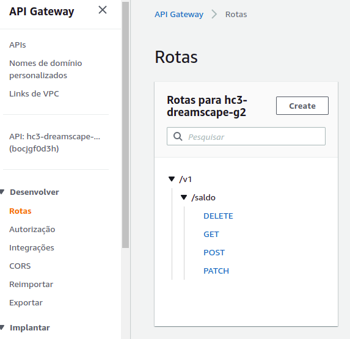
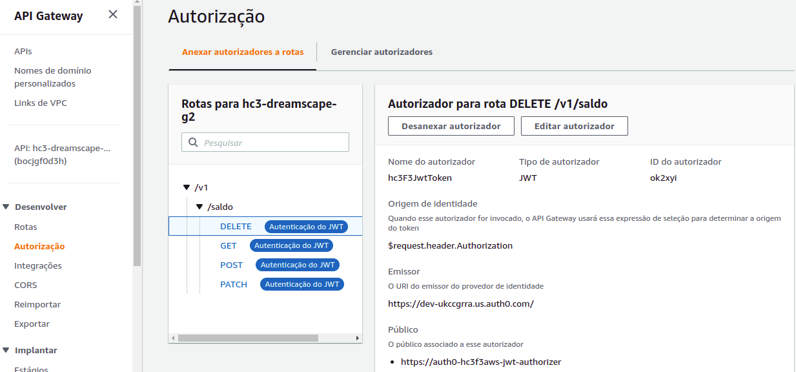
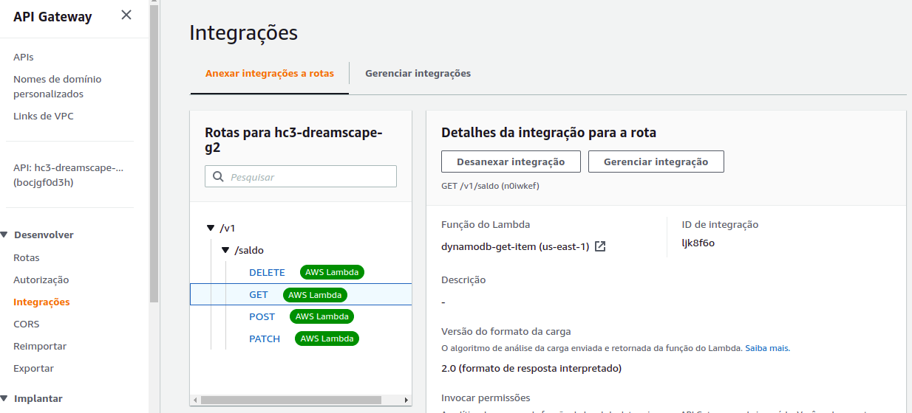
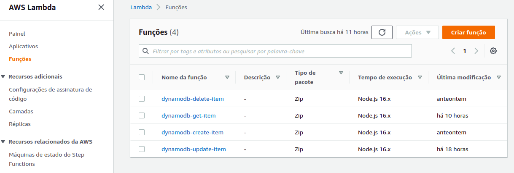

<div>
   
</div>

# Apresentação
Este repositório é parte do bootcamp ["Hiring Coders #3"](https://www.hiringcoders.com.br/). 
Este projeto entrega uma loja funcional com sistema de recompensa implementado, cumprindo o desafio da semifinal da Fase 3.

## Equipe
- Alberto Victor Rebello
- Arthur Candido
- Ciro Carvalho de Jesus
- Victor Cesar Evangelista

## Tecnologias e Ferramentas
<div>


</div>


## Lista de pastas
A master branch tem a versão funcional do código do projeto. Ele está separado em pastas e sua descrição resumida encontra-se abaixo:

| Folder |Description|
|-|-|
| Backend AWS | Virtual Wallet APP |
| Backend VTEX | Orders Feed APP |
| FRONTEND | Posterium Theme APP + Point Counter APP |
| IMAGES | Imagens relacionadas ao readme file. |

## Jornada do Consumidor

## Atividades Realizadas e programadas para V2.0

[Lista de Atividades](https://github.com/AlbertoVictorRebello/hiring-coders-fase3-dreamscape-grupo2/blob/master/images/Dreamscape%20Grupo%202%20-%20Atividades.pdf)

## Instruções de Uso
- nononononononono.

- nononononononono:

  ```npm install```

### Como clonar o projeto
- nonononon

# Front Store
### hiring-coders-fase3
Este repositório conterá o projeto completo do desafio da semifinal: a loja VTEX e de suas funcionalidades.

### Primeiro passo
Dividir tarefas entre os integrantes do time.

## Backend AWS

AWS Api Gateway + AWS Lambda Functions + AWS DynamoDB + Auth0


- Os vídeos abaixo serão úteis para o processo de:
  - Criação do backend com AWS Api Gateway + AWS Lambda Functions + AWS DynamoDB
  - Inclusão de camada de segurança usando o provedor Auth0


- API Gateway ‘hc3-dreamscape-g2’:
  - Configurar as rotas conforme abaixo:

<div>
 
</div>


  - Configurar as autorizações das rotas conforme abaixo:
<div>
 
</div>

- Configurar as integrações conforme abaixo:

<div>
 
</div>

 - Em CORS, configurar Access-Control-Allow-Origin com ‘*’.


- Criar as Lambda Functions conforme abaixo:
<div>
 
</div>

- Para cada lambda function, criar as seguintes variáveis de ambiente:
 - TABLE		carteira-virtual 
 -  DEBUG	true

- Configurar o acesso ao DynamoDB em permissões.

- Criar as integrações em API Gateway conforme abaixo:

<div>
 
</div>

- Incluir a camada de segurança usando o provedor Auth0.

- Veja abaixo as instruções de como configurar o Postman, ou outra ferramenta de sua escolha, para testar a api:


- Criar uma tabela no DynamoDB com 
aws-dynamodb-table

- Consultar Auth0 para atualizar o Token:
  - Método: 
    - POST
  - URL:
    - https://dev-ukccgrra.us.auth0.com/oauth/token
  - Body:
    - {"client_id":"nfJZyeojvUawCMUX5hoHlx0MkckUh9Ml","client_secret":"B2OfmdO8JQl29fcYVPsYctVgF--LhS2rR1Rvcq-31P7K0e2KtZDiwyqQ-FgJ5c81","audience":"https://auth0-hc3f3aws-jwt-authorizer","grant_type":"client_credentials"}

- Criar um registro:
  - Método:
     - POST
  - URL:
    - https://bocjgf0d3h.execute-api.us-east-1.amazonaws.com/v1/saldo
  - Authorization:
    - Bearer Auth0 Token
  - Body:
    - {     
      "email": usuario1@users.com",
      "saldo": 0
}

- Consultar todos os registros:
  - Método:
    - GET
  - URL:
    - https://bocjgf0d3h.execute-api.us-east-1.amazonaws.com/v1/saldo
  - Authorization:
    - Bearer Auth0 Token

- Consultar um registro por email (getByEmail):
  - Método:
    - GET
  - URL:
    - https://bocjgf0d3h.execute-api.us-east-1.amazonaws.com/v1/saldo/
  - Authorization:
    - Bearer Auth0 Token
  - Body:
    - {
    "email": "usuario1@users.com"
}


- Atualizar o saldo de um registro (updateByEmail):
  - Método:
    - PATCH
  - URL:
    - https://bocjgf0d3h.execute-api.us-east-1.amazonaws.com/v1/saldo
  - Authorization:
    - Bearer Auth0 Token
  - Body:
    - {"email": "usuario1@users.com",
      "pontos": 50
}
  - Response:
    - {
    "updated_at": "2022-07-19T19:54:03.324Z",
    "created_at": "2022-07-19T19:35:14.478Z",
    "email": "usuario1@users.com",
    "saldo": 50
}

- Excluir um registro por email:
  - Método:
     - DELETE
  - URL:
    - https://bocjgf0d3h.execute-api.us-east-1.amazonaws.com/v1/saldo
  - Authorization:
    - Bearer Auth0 Token
  - Body:
    - {"email": usuario1@users.com"
}

 
